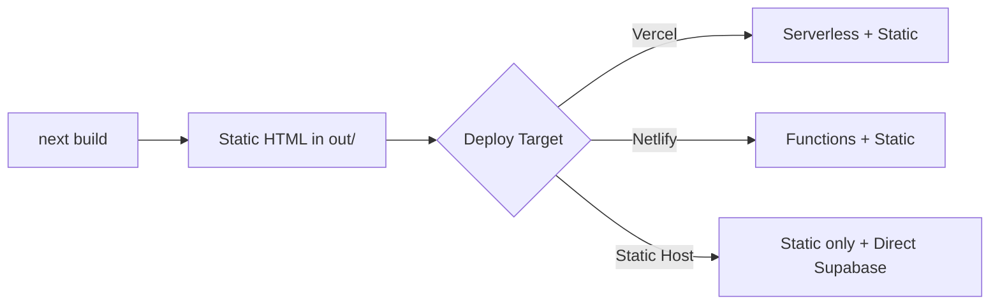
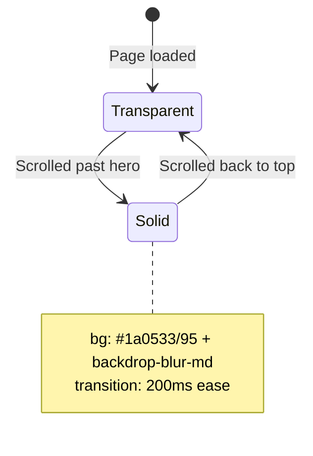
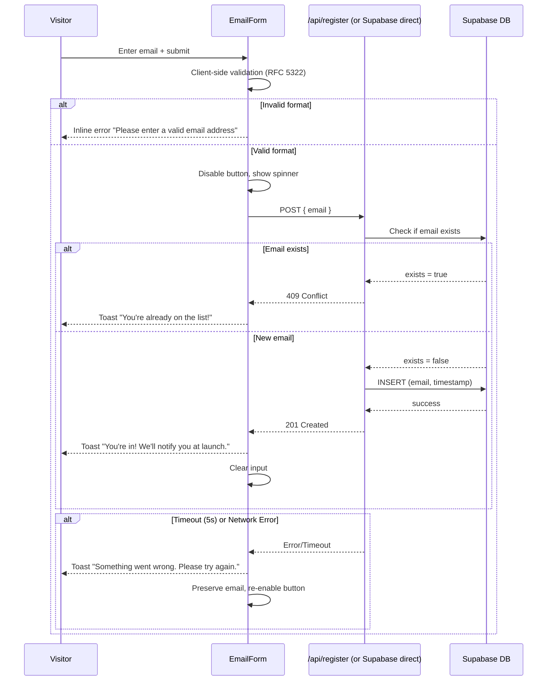
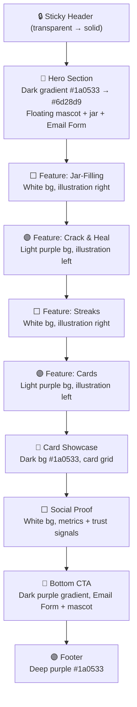

# Design Document: Habby Landing Page

## Overview

The Habby Landing Page is a standalone, statically-exported Next.js website that serves as a pre-registration funnel for the Habby habit tracker app. It follows a GDevelop-inspired dark/bold/illustrated visual style adapted to Habby's purple brand identity, featuring floating mascot and jar illustrations, alternating dark-to-light section backgrounds, and bold typography with accent-colored keywords.

The site is a single-page experience optimized for conversion: every section either educates (feature showcase, card gallery) or converts (email capture). Two email forms (hero + bottom CTA) ensure visitors always have a registration opportunity in view. The backend is a lightweight Supabase integration for email storage with a serverless function fallback pattern.

### Key Design Decisions

1. **Separate project** (`habby-landing/`) — no shared deps with the React Native app. Clean boundary, independent deploy cycle.
2. **Static export** — `output: 'export'` means zero server runtime. The `/api/register` endpoint works on platforms that support serverless functions (Vercel, Netlify); otherwise the client calls Supabase directly.
3. **Framer Motion** for scroll-triggered animations — lightweight, tree-shakeable, respects `prefers-reduced-motion` natively.
4. **Tailwind CSS** — rapid iteration on the dark gradient + card-heavy layout without custom CSS overhead.
5. **GDevelop-inspired visual language** — dark gradient hero with floating illustrations, alternating section backgrounds, bold headlines with colored keywords, and platform badge rows.

## Architecture

```mermaid
graph TD
    subgraph "habby-landing/ (Next.js Static Export)"
        A[app/page.tsx] --> B[Hero Section]
        A --> C[Features Sections]
        A --> D[Card Showcase]
        A --> E[Social Proof]
        A --> F[Bottom CTA]
        A --> G[Footer]

        B --> H[EmailForm Component]
        F --> H

        H -->|Client Submit| I{Serverless Available?}
        I -->|Yes| J[/api/register]
        I -->|No| K[Direct Supabase REST]

        J --> L[(Supabase DB)]
        K --> L
    end

    subgraph "Supabase"
        L --> M[registrations table]
    end

    subgraph "Assets"
        N[Mascot SVG/PNG]
        O[Jar Illustrations]
        P[Card Artwork from habby/assets/images/]
        Q[App Preview Mockup]
    end
```

### Deployment Flow



## Components and Interfaces

### Component Tree

```
app/
├── layout.tsx              — Root layout (Inter font, meta tags, JSON-LD)
├── page.tsx                — Single page composing all sections
├── api/
│   └── register/route.ts   — Serverless email submission endpoint
└── privacy/page.tsx        — Privacy policy page

components/
├── layout/
│   ├── StickyHeader.tsx    — Fixed nav with logo + "Get Notified" CTA
│   └── Footer.tsx          — Copyright, privacy link, social icons
├── sections/
│   ├── HeroSection.tsx     — Dark gradient hero with mascot + form
│   ├── FeatureSection.tsx  — Reusable feature block (alternating layout)
│   ├── CardShowcase.tsx    — Card gallery grid with hover effects
│   ├── SocialProof.tsx     — Metrics + trust signals
│   └── CtaSection.tsx      — Bottom CTA with secondary email form
├── ui/
│   ├── EmailForm.tsx       — Shared email input + submit + validation
│   ├── Toast.tsx           — Toast notification system
│   ├── CardTile.tsx        — Individual card in the showcase
│   ├── FloatingIllustration.tsx — Parallax-floating decorative image
│   └── AnimatedSection.tsx — Scroll-triggered fade-up wrapper
└── lib/
    ├── supabase.ts         — Supabase client initialization
    ├── submitEmail.ts      — Email submission logic (serverless or direct)
    └── constants.ts        — Brand colors, rarity colors, feature data
```

### Key Component Interfaces

```typescript
// EmailForm.tsx
interface EmailFormProps {
  variant: 'hero' | 'cta';        // Controls sizing/styling
  onSuccess?: () => void;          // Callback after successful submission
}

// FeatureSection.tsx
interface FeatureSectionProps {
  title: string;                   // Section heading
  accentWord?: string;             // Word to highlight in brand color
  description: string;             // Body copy
  illustration: StaticImageData;   // Feature illustration
  illustrationAlt: string;         // Alt text
  illustrationSide: 'left' | 'right'; // Alternating layout
  bgVariant: 'dark' | 'light' | 'purple'; // Section background
}

// CardTile.tsx
interface CardTileProps {
  name: string;                    // Card name (truncated at 24 chars)
  image: StaticImageData | null;   // null = locked placeholder
  rarity: 'common' | 'uncommon' | 'rare';
  stars: number;                   // 1-5, supports 0.5 increments
  isLocked: boolean;
}

// StickyHeader.tsx
interface StickyHeaderProps {
  ctaTargetId: string;             // ID of bottom CTA section for scroll-to
}

// Toast system
type ToastType = 'success' | 'error' | 'info';
interface ToastMessage {
  id: string;
  type: ToastType;
  message: string;
}
```

### StickyHeader Behavior



### Email Submission Flow



## Data Models

### Supabase Schema

```sql
CREATE TABLE registrations (
    id UUID DEFAULT gen_random_uuid() PRIMARY KEY,
    email TEXT NOT NULL UNIQUE,
    created_at TIMESTAMPTZ DEFAULT NOW() NOT NULL
);

-- Index for duplicate checking
CREATE INDEX idx_registrations_email ON registrations (email);

-- RLS policy: insert-only from anon, no reads from client
ALTER TABLE registrations ENABLE ROW LEVEL SECURITY;

CREATE POLICY "Allow anonymous insert" ON registrations
    FOR INSERT TO anon
    WITH CHECK (true);

CREATE POLICY "Allow count for social proof" ON registrations
    FOR SELECT TO anon
    USING (true);
```

### API Request/Response

```typescript
// POST /api/register
interface RegisterRequest {
  email: string; // max 254 chars, RFC 5322 format
}

interface RegisterResponse {
  success: boolean;
  message: string;
  // 201: "Email registered successfully"
  // 409: "Email already registered"
  // 400: "Invalid email format"
  // 500: "Internal server error"
}

// GET /api/count (or direct Supabase RPC)
interface CountResponse {
  count: number; // Raw count, client rounds to nearest 50
}
```

### Static Data Constants

```typescript
// Card showcase data (subset of habby/assets/images catalog)
interface ShowcaseCard {
  id: string;
  name: string;
  image: string;         // Path to card image
  rarity: 'common' | 'uncommon' | 'rare';
  stars: number;
  isLocked: boolean;
}

// Feature section content
interface FeatureContent {
  id: string;
  title: string;
  accentWord: string;
  description: string;
  illustration: string;
  illustrationAlt: string;
}

// Brand constants
const BRAND = {
  primary: '#6d28d9',
  primaryDeep: '#5b21b6',
  dark: '#1a0533',
  rarityColors: {
    common: '#94a3b8',
    uncommon: '#22c55e',
    rare: '#3b82f6',
  },
} as const;
```

### Page Section Layout (Visual Order)



## Correctness Properties

*A property is a characteristic or behavior that should hold true across all valid executions of a system — essentially, a formal statement about what the system should do. Properties serve as the bridge between human-readable specifications and machine-verifiable correctness guarantees.*

### Property 1: Email validation accepts valid and rejects invalid

*For any* string that conforms to RFC 5322 simplified format (local@domain.tld, ≤254 characters), the email validator SHALL accept it; and *for any* string that does not conform (missing @, missing TLD, exceeding 254 characters, empty string, whitespace-only), the validator SHALL reject it and return an error.

**Validates: Requirements 1.6, 5.1, 5.2, 5.8**

### Property 2: Email submission round-trip

*For any* valid email string that does not already exist in the database, submitting it through the registration flow SHALL result in a stored record containing that exact email address and a UTC timestamp, and the response SHALL indicate success.

**Validates: Requirements 1.5, 5.4, 5.7**

### Property 3: Card name truncation

*For any* card name string, if its length exceeds 24 characters, the displayed name SHALL be truncated to 24 characters followed by an ellipsis; if its length is 24 characters or fewer, the full name SHALL be displayed without modification.

**Validates: Requirements 3.1**

### Property 4: Milestone count rounding

*For any* non-negative integer registration count, the displayed milestone number SHALL equal `Math.floor(count / 50) * 50`, and the label format SHALL be "Join {milestone}+ early supporters".

**Validates: Requirements 4.1**

## Error Handling

### Email Submission Errors

| Scenario | Detection | User Feedback | Recovery |
|----------|-----------|---------------|----------|
| Invalid email format | Client-side regex before submit | Inline error below input: "Please enter a valid email address" | Input preserved, user corrects |
| Duplicate email | 409 response from API | Toast: "You're already on the list!" | Input cleared (not an error state) |
| Network timeout (5s) | AbortController timeout | Toast: "Something went wrong. Please try again." | Input preserved, button re-enabled |
| Server error (5xx) | Non-2xx response | Toast: "Something went wrong. Please try again." | Input preserved, button re-enabled |
| Supabase unreachable (count) | Fetch failure | Static fallback: "Join our growing community" | No retry needed |

### Image Loading Errors

| Asset | Fallback |
|-------|----------|
| Mascot illustration | Hidden via CSS (`object-fit` container collapses) |
| Card images | Skeleton placeholder (1.4 aspect ratio) for 5s → static fallback after 10s |
| Feature illustrations | Placeholder matching expected dimensions |
| Any `` | `onError` handler sets `display: none` or shows placeholder div |

### Implementation Pattern

```typescript
// submitEmail.ts — unified submission with fallback
export async function submitEmail(email: string): Promise<RegisterResponse> {
  const controller = new AbortController();
  const timeout = setTimeout(() => controller.abort(), 5000);

  try {
    // Try serverless endpoint first
    const res = await fetch('/api/register', {
      method: 'POST',
      headers: { 'Content-Type': 'application/json' },
      body: JSON.stringify({ email }),
      signal: controller.signal,
    });
    clearTimeout(timeout);
    return await res.json();
  } catch (e) {
    clearTimeout(timeout);
    // Fallback: direct Supabase insert
    try {
      return await directSupabaseInsert(email);
    } catch {
      return { success: false, message: 'Something went wrong. Please try again.' };
    }
  }
}
```

## Testing Strategy

### Unit Tests (Example-Based)

Focus on specific scenarios and static rendering:

- **Hero section rendering**: headline text, mascot/preview images with alt text, email form presence
- **Feature section ordering**: DOM order matches specification
- **Card showcase**: minimum 6 cards, at least 2 locked placeholders, rarity colors applied
- **Sticky header**: transparent by default, solid after scroll, z-index assertion
- **Responsive layouts**: mobile (375px), tablet (768px), desktop (1024px) breakpoints
- **Accessibility**: reduced-motion disables animations, semantic HTML structure, ARIA attributes
- **SEO**: meta tags, JSON-LD schema, heading hierarchy
- **Error states**: network failure toast, image fallback placeholders, mascot hidden on error
- **Form UX**: button disabled during submission, loading spinner, input preserved on error

### Property-Based Tests (Universal Properties)

Using **fast-check** as the PBT library for TypeScript/Next.js.

Each test runs minimum 100 iterations with randomized inputs.

| Property | What's Generated | What's Verified |
|----------|-----------------|-----------------|
| Email validation | Random strings (valid RFC 5322 + invalid variants) | Correct accept/reject classification |
| Email round-trip | Random valid emails | Stored record matches submitted email + has timestamp |
| Card name truncation | Random strings of varying length (0-100 chars) | Truncation at 24 chars with ellipsis, or full display |
| Milestone rounding | Random non-negative integers (0-100000) | floor(n/50)*50 formula matches displayed value |

Tag format: `// Feature: habby-landing-page, Property {N}: {title}`

### Integration Tests

- **Email submission flow**: POST to `/api/register`, verify Supabase insertion
- **Duplicate detection**: Submit same email twice, verify 409 on second attempt
- **Social proof count**: Verify count endpoint returns correct number
- **Serverless fallback**: Mock `/api/register` failure, verify direct Supabase path works

### Build Verification

- `next build` completes without errors
- Static `out/` directory produced
- All pages pre-rendered as HTML
- No server-side runtime dependencies in output

